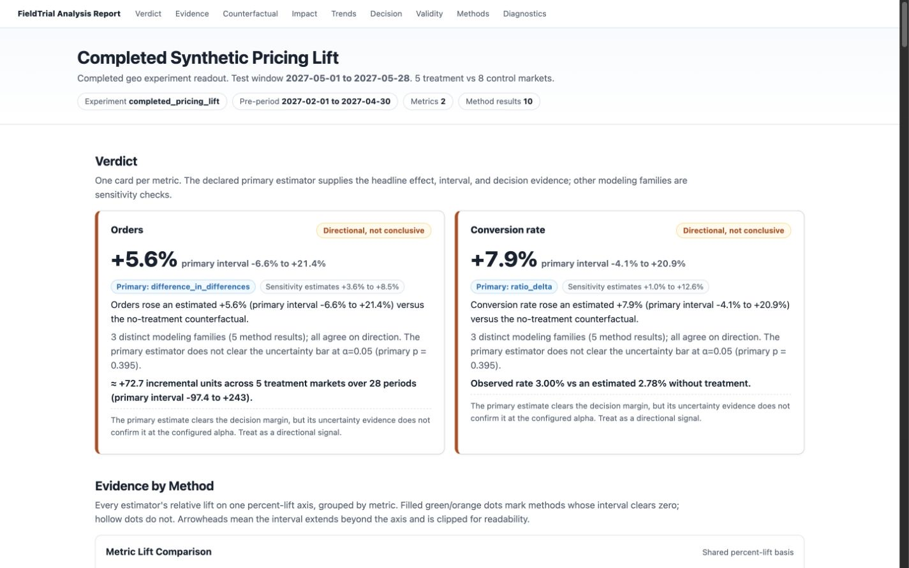
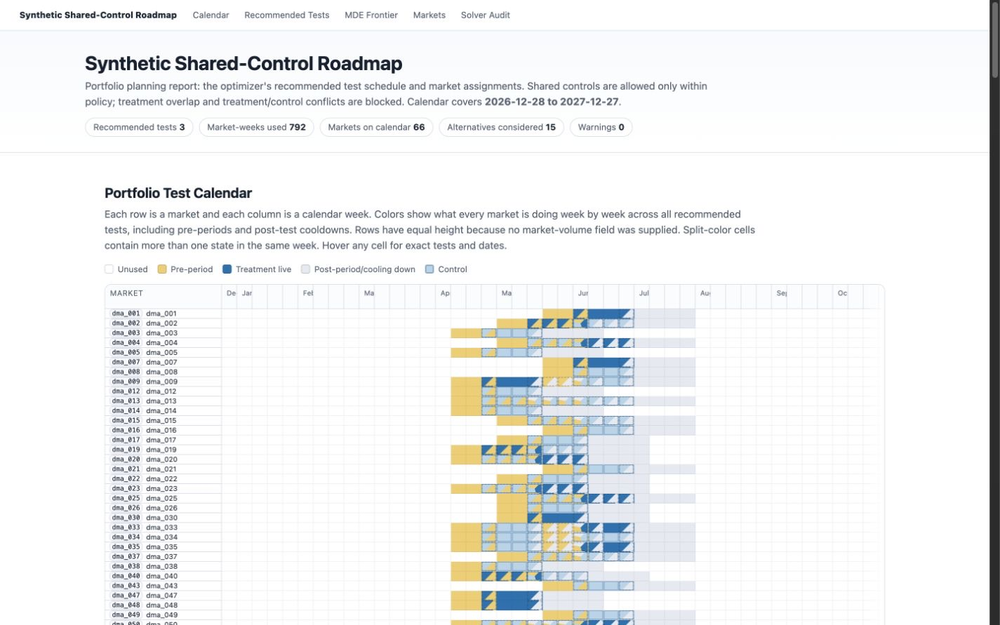

# FieldTrial

**Plan a portfolio of geo experiments. Measure each test with transparent causal evidence.**

[](https://www.python.org/downloads/)
[](LICENSE)
[](#project-status)

FieldTrial is a Python toolkit for teams that run real-world experiments across markets, regions,
stores, territories, or other geographic units. It connects the work that usually lives in separate
spreadsheets and scripts: power analysis, market assignment, portfolio scheduling, completed-test
measurement, decisioning, and reporting.

Most geo experimentation tools focus on one test at a time. FieldTrial treats scarce market capacity
as a portfolio constraint. It can share controls when policy permits, blocks conflicting treatment
exposure, respects cooldowns, and leaves behind auditable artifacts for both people and software
agents.



<p align="center"><em>A completed-test report generated from the included synthetic example.</em></p>

## Where FieldTrial fits

Use FieldTrial when you need to:

- **Build a quarterly or annual test roadmap** across marketing, pricing, product, marketplace,
  lifecycle, operations, or policy teams competing for the same markets.
- **Design a feasible geo experiment** with treatment/control balance, MDE scoring, shared-control
  rules, cooldowns, and interference constraints made explicit.
- **Measure a completed test with a predeclared primary model** while comparing DiD, bootstrap,
  synthetic-control, synthetic-DiD, matrix-completion, time-series, and ratio-aware estimators as
  clearly labeled sensitivity evidence under a common result contract.
- **Turn estimates into a decision document** with metric-level verdicts, absolute impact,
  counterfactual plots, inference details, validity checks, warnings, and diagnostics.
- **Monitor and replan a live roadmap** as experiments finish, slip, fail checks, or consume market
  capacity differently from plan.
- **Calibrate methodology against your own data** with placebo windows, effect injection, and
  replay-based power analysis.

## What makes it different

### Portfolio planning is a first-class problem

Every use of a market is represented in one market-time assignment matrix. The optimizer chooses a
portfolio of candidate designs while enforcing treatment exclusivity, treatment/control conflicts,
shared-control caps, active-test commitments, and cooldowns. This makes the final calendar feasible
as a whole, not merely a collection of individually valid tests.

### Planning and measurement share one methodology layer

Typed metric definitions, experiment specs, estimands, method metadata, inference results, and
calibration results travel through the system. The assumptions used to score a design can therefore
remain visible when the completed test is analyzed and reported.

### Evidence stays inspectable

FieldTrial does not collapse every method into an unlabeled average. Results retain the estimator,
estimand, method family, interval, p-value, assumptions, failure modes, fit diagnostics, calibration,
and warnings. A declared primary estimator and inference method drive the decision; other modeling
families remain visible without being mistaken for independent replications or creating an
"any-significant-method-wins" rule. Interval payloads identify their statistical meaning—confidence
set, prediction interval, conformal set, uncertainty envelope, or sequential bound—and the exact
estimand they cover.

### Reports are decision documents, not chart dumps

Self-contained HTML reports lead with the decision, then expose the evidence behind it. Planning
reports show the portfolio calendar, selected designs, MDE tradeoffs, market characteristics,
shared-control use, and solver audit. Analysis reports show metric verdicts, method comparisons,
counterfactuals, absolute impact, observed trends, decision rules, validity checks, and estimator
detail.



<p align="center"><em>A portfolio calendar with pre-periods, live treatment, controls, and cooldowns.</em></p>

## Agent-first and token-efficient

FieldTrial is designed for coding agents and automation systems as primary operators, while keeping
the final artifacts useful to experimenters and decision-makers.

- **Compact JSON on stdout.** Add `--json` to validation, planning, registry, monitoring, and
  analysis commands. Completed-test analysis returns the decision summary and one compact row per
  estimator instead of streaming chart series or raw diagnostics into context.
- **Details on demand.** Full estimator artifacts, visual data, and self-contained HTML reports are
  written separately. An agent can inspect the compact result first and open deeper evidence only
  when a warning or decision requires it.
- **Portfolio summaries instead of N large reads.** `analyze-portfolio` produces a compact decision
  table across completed tests while keeping each detailed analysis in its own artifact.
- **Schemas before generation.** Roadmap and completed-test JSON Schemas let an agent construct and
  validate configuration safely before running expensive work.
- **Deterministic, verifiable artifacts.** Planning and analysis workflows write sidecar manifests
  with paths, byte counts, and SHA-256 hashes for replay and audit.
- **Structured failures and safe mutations.** Machine-readable errors include remediation; registry
  imports support `--dry-run`.

The token efficiency is deliberate: agents reason over the smallest decisive surface and leave large
diagnostics and visualization payloads at rest until they are actually needed. See the
[agent usage guide](docs/agent_usage.md) for the recommended operating pattern.

## Quickstart

FieldTrial currently targets Python 3.11 and 3.12. Install from the repository:

```bash
git clone https://github.com/warrenwjackson/fieldtrial.git
cd fieldtrial
python -m venv .venv
source .venv/bin/activate
pip install -e .
```

Run an end-to-end synthetic planning workflow:

```bash
fieldtrial generate-synthetic-data examples/data/synthetic_panel.parquet \
  --us-shaped --markets 100

fieldtrial validate-panel examples/data/synthetic_panel.parquet --json

fieldtrial solve examples/configs/shared_controls_roadmap.yaml \
  --panel examples/data/synthetic_panel.parquet \
  --out examples/artifacts/plan.json \
  --json

fieldtrial report-plan examples/artifacts/plan.json \
  --out examples/reports/plan.html
```

Then analyze the included completed synthetic experiment:

```bash
python examples/scripts/run_completed_test_analysis.py
```

Or use the Python API directly:

```python
from fieldtrial import GeoPanel, PortfolioPlanner, RoadmapSpec

panel = GeoPanel.from_parquet("examples/data/synthetic_panel.parquet")
roadmap = RoadmapSpec.from_yaml("examples/configs/shared_controls_roadmap.yaml")

solution = PortfolioPlanner(panel, roadmap).solve(max_per_test=25)
solution.save("examples/artifacts/plan.json")
solution.report("examples/reports/plan.html")
```

## Core capabilities

| Area | Included capabilities |
| --- | --- |
| Data | Long-format geo panels; Parquet, DuckDB, SQL-query, and callable adapters; panel validation; deterministic synthetic data |
| Metrics | Count, continuous, ratio-of-sums, and composite metrics with display names, units, and consistent number/percent/currency formatting |
| Design | YAML/JSON roadmap and completed-test specs, assignment policies, balance diagnostics, matching, super-geos, interference checks, cooldowns |
| Power | Duration-aware analytic MDEs, simulation, placebo replay, and effect injection |
| Portfolio optimization | Deterministic candidate generation, CP-SAT selection, shared controls, learning-value bonuses, covariance and overlap-risk penalties |
| Measurement | DiD, ratio delta, block bootstrap, CUPED, synthetic control, augmented SCM, synthetic DiD, MC-NNM matrix completion, TBR, paired iROAS, forecasting, and state-space counterfactuals |
| Inference | Estimand-matched small-sample and ratio-aware intervals, bootstrap, conformal, randomization, few-cluster, Holm multiplicity by default, sequential, jackknife, and placebo procedures |
| Operations | SQLite experiment registry, bootstrap imports, roadmap monitoring, replanning, portfolio decisioning, manifests, and compact JSON outputs |
| Reporting | Self-contained planning and analysis reports with human-readable verdicts and embedded machine-readable payloads |

## Agent-oriented CLI pattern

```bash
# Validate before expensive work.
fieldtrial validate-roadmap roadmap.yaml --json
fieldtrial validate-completed completed.yaml --json

# Export schemas before an agent generates configuration.
fieldtrial schema roadmap --out schemas/roadmap.schema.json
fieldtrial schema completed --out schemas/completed.schema.json

# Inspect compact stdout; open the detailed artifacts only when needed.
fieldtrial analyze completed.yaml \
  --panel panel.parquet \
  --out artifacts/analysis.json \
  --json

# Analyze several completed tests without reading every detailed artifact.
fieldtrial analyze-portfolio completed_a.yaml completed_b.yaml \
  --panel panel.parquet \
  --out artifacts/portfolio_analysis.json \
  --json

# Preview registry changes safely.
fieldtrial registry import active_tests.csv --dry-run --json
```

## Documentation

- [Agent usage](docs/agent_usage.md): compact outputs, schemas, dry runs, and artifact-reading order.
- [Method choice](docs/method_choice.md): which estimator families fit which designs and failure
  modes.
- [Methodology](docs/methodology.md): estimands, inference, calibration, and validation principles.
- [Architecture](docs/architecture.md): package layers, assignment-matrix invariants, and data flow.
- [Examples](examples/): runnable configs, scripts, synthetic panels, artifacts, and reports.

## Optional estimator backends

The base package includes native estimators. Optional integrations can be installed by capability:

```bash
pip install -e ".[estimators,bayes]"
```

<details>
<summary>External SDID and matrix-completion reference backends</summary>

The published `synthdid` 0.10.1 package pins an older scientific Python stack. Python 3.12
environments should use FieldTrial's native `synthetic_did` estimator by default. To run an explicit
external reference check against the tested source revision:

```bash
pip install -e ".[dev,estimators,bayes]"
pip install "matplotlib>=3.7"
pip install --no-deps \
  "git+https://github.com/d2cml-ai/synthdid.py@3c66b2df5fab873e623cc024736d86b71b867a1f"
```

`mlsynth` is not currently installable from PyPI under that package name, but its source package can
be installed for external SDID, matrix-completion, or synthetic-control comparisons:

```bash
pip install "git+https://github.com/jgreathouse9/mlsynth.git"
```

FieldTrial does not silently substitute either package for a native estimator. External backends are
used only for explicit reference checks.

</details>

## Development

```bash
pip install -e ".[dev]"
pytest
ruff check .
```

## Project status

FieldTrial is alpha software preparing for a first public release. Interfaces may still change as the
methodology and report contracts are hardened.

Geo experiments remain observationally fragile even when the software is careful. FieldTrial makes
assumptions, diagnostics, calibration, and sensitivity evidence visible; it does not guarantee causal
validity. Review the design, counterfactual fit, uncertainty method, spillover risk, and domain context
before acting on a result.

Licensed under the [Apache License 2.0](LICENSE).
