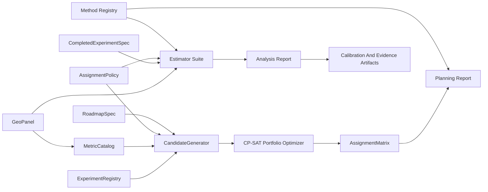

# Architecture

FieldTrial separates geo experimentation into five layers.

1. Data: `GeoPanel` wraps a long-format panel with `geo_id`, `date`, and metric columns.
2. Metrics, specs, and methodology contracts: typed metric definitions, Pydantic specs, `EstimandSpec`, `MethodMetadata`, `InferenceResult`, and `CalibrationResult` make methods explicit.
3. Design: `AssignmentPolicy` defines feasible assignment spaces; `AssignmentMatrix` is the single source of truth for treatment/control market-time usage.
4. Planning and measurement: candidates are generated per test, then CP-SAT chooses a portfolio. Completed tests are analyzed through a common estimator interface.
5. Reports and artifacts: planning and analysis reports expose assumptions, diagnostics, inference, calibration, family-aware consensus, and replay metadata.

## Data Flow

## Assignment Matrix Rule

Every hard overlap rule is checked through market-date roles:

- a market can be treatment for at most one overlapping test;
- a market cannot be treatment in one active test and control in another overlapping test;
- a market can be control for multiple active tests up to `max_shared_control_usage`;
- cooldown blocks are applied before a market can be treated again.

This keeps FieldTrial focused on interpretable single-treatment exposure designs.

## Method Registry Rule

Every method-facing artifact should carry method metadata rather than relying on
name recognition. Estimators, inference engines, design policies, calibration
helpers, and portfolio methods declare:

- estimand metadata;
- method family and independent evidence family;
- implementation status and optional backend availability;
- assumptions, failure modes, contraindications, and expected artifacts.

Reports use independent evidence family for headline consensus. Duplicate
estimators inside the same family remain visible but do not multiply the
headline strength of evidence.
